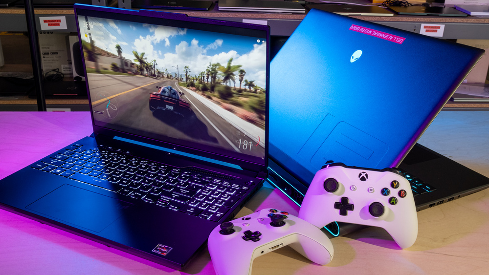

# Ex02 Commercial Website
## Date: 12.08.2025

## AIM
To create a commercial website using CSS Flexbox.

## ALGORITHM
### STEP 1
Create an HTML file (index.html)

### STEP 2
Create a CSS file (style.css)

### STEP 3
Include a navigation bar with links to different sections.

### STEP 4
Add structured sections for Homepage, Products / Services, About Us, Contact Details and User Account.

### STEP 5
Include social media links at the footer with copyright information.

### STEP 6
Define global styles for fonts, colors, and layout.

### STEP 7
Style the header, navigation bar, and sections.

### STEP 8
Use Flexbox for layout design.

### STEP 9
Add hover effects and transitions for interactivity.

### STEP 10
Add Images and Media.

### STEP 11
Use optimized images for a professional look.

### STEP 12
Open the HTML file in a browser to check layout and functionality.

### STEP 13
Fix styling issues and refine content placement.

### STEP 14
Deploy the website.

### STEP 15
Upload to GitHub Pages for free hosting.

## PROGRAM
### index.html
```
<!DOCTYPE html>
<html lang="en">
<head>
    <meta charset="UTF-8">
    <meta name="viewport" content="width=device-width, initial-scale=1.0">
    <title>Commercial Website</title>
    <link rel="stylesheet" href="style.css">
</head>
<body>
    <header>
        <nav class="navbar">
            <div class="logo">MyBusiness</div>
            <ul class="nav-links">
                <li><a href="#home">Home</a></li>
                <li><a href="#products">Products</a></li>
                <li><a href="#about">About Us</a></li>
                <li><a href="#contact">Contact</a></li>
                <li><a href="#account">Account</a></li>
            </ul>
        </nav>
    </header>

    <section id="home" class="home">
        <h1>Welcome to Our Commercial Website</h1>
        <button>Shop Now</button>
    </section>

    <section id="products" class="products">
        <h2>Our Products</h2>
        <div class="product-list">
            <div class="product-card">
                
                <h3>Smartphone</h3>
                <p>₹14,999</p>
            </div>
            <div class="product-card">
                
                <h3>Wireless Headphones</h3>
                <p>₹2,499</p>
            </div>
            <div class="product-card">
                
                <h3>Asus Laptop</h3>
                <p>₹99,999</p>
            </div>
        </div>
    </section>

    <!-- About Us Section -->
    <section id="about" class="about">
        <h2>About Us</h2>
        <p>
            We are a trusted company with years of experience delivering high-quality products and services.
        </p>
    </section>

    <section id="contact" class="contact">
        <h2>Contact Us</h2>
        <p>Email: <a href="mailto:namikazeashwin@gmail.com">ashwin@gmail.com.com</a></p>
        <p>Phone: +91 9884537778</p>
    </section>

    <footer>
        <a>Name: Ashwin Kumar A</a>
        <p>&copy; 2025 Ashwin Business. All rights reserved.</p>
    </footer>

</body>
</html>
```
### style.css
```
* {
    margin: 0;
    padding: 0;
    box-sizing: border-box;
}
body {
    font-family: Arial, sans-serif;
    background-color: #f78f8f;
    color: #0e0e0e;
}

.navbar {
    display: flex;
    justify-content: space-between;
    align-items: center;
    background: #222;
    padding: 1rem 2rem;
}
.logo {
    font-size: 1.5rem;
    font-weight: bold;
    color: white;
}
.nav-links {
    list-style: none;
    display: flex;
    gap: 20px;
}
.nav-links a {
    color: white;
    text-decoration: none;
    transition: color 0.3s;
}

.home {
    color: white;
    text-align: center;
    padding: 100px 20px;
}
.home h1 {
    font-size: 2.5rem;
}
.home button {
    background: #00ffff;
    border: none;
    padding: 10px 20px;
    margin-top: 15px;
    font-size: 1rem;
    cursor: pointer;
    transition: background 0.3s;
}
.home button:hover {
    background: #83da74;
}

.products {
    padding: 50px 20px;
    text-align: center;
}
.product-list {
    display: flex;
    gap: 20px;
    justify-content: center;
    flex-wrap: wrap;
}
.product-card {
    background: rgb(136, 255, 239);
    border-radius: 8px;
    padding: 15px;
    width: 250px;
    box-shadow: 0 4px 8px rgba(0,0,0,0.1);
    transition: transform 0.3s;
}
.product-card:hover {
    transform: scale(1.05);
}
.product-card img {
    width: 100%;
    height: 180px;
    object-fit: cover;
    border-radius: 8px;
}

.about, .contact, .account {
    padding: 50px 20px;
    text-align: center;
    margin-top: 20px;
}

.contact a {
    color: #ffffff;
    text-decoration: none;
}
.contact a:hover {
    text-decoration: underline;
}

.account button {
    background: #222;
    color: white;
    border: none;
    padding: 10px 20px;
    margin: 10px;
    cursor: pointer;
    transition: background 0.3s;
}
.account button:hover {
    background: #444;
}

footer {
    background: #222;
    color: white;
    text-align: center;
    padding: 15px 0;
    margin-top: 20px;
}
.social-links a {
    color: #ff9800;
    text-decoration: none;
}
.social-links a:hover {
    text-decoration: underline;
}
```
## OUTPUT


## RESULT
The program for creating commercial website using CSS Flexbox is executed successfully.
